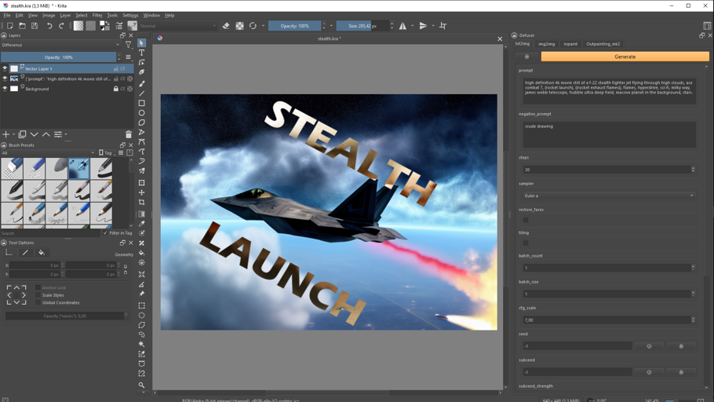

# 

current release: `v0.0.1-alpha`
 
release date: `22.10.2022`
 
A Plugin for Photoshop and Krita that can interface with [AUTOMATIC1111s Stable Diffusion WebUI](https://github.com/AUTOMATIC1111/stable-diffusion-webui). 
 __You won't need to switch to another WebUI or modify your existing installation in any way.__

## Features
* text to image
* image to image
* inpainting
* outpainting
* inside Photoshop and Krita, so:
    * __NO__ fussing around with the inpainter tool in the browser / uploading masks
    * __NO__ copying and pasting from and to WebUI
    * __NO__ context switching just because you needed a new batch of images

#### Planned features:
* upscaling support ( for now, do it in the WebUI)
* further workflow improvements
* standalone face fix
* pause and interrupt
* "render queue"
* experiments

## Installation

#### Krita
1. Copy this url to your clipboard: `https://internationaltd.github.io/defuser/build/defuser-pykrita.zip`
2. With Krita open, go to `Tools - Scripts - Import Python Plugin from Web` and paste the link
3. Hit yes to activate, then restart Krita
4. Open the docker from `Settings - Dockers - Defuser` and start proomting!

* alternatively, you can also download the release and install via `Tools - Scripts - Import Python Plugin from file`

#### Photoshop
1. [Download the latest release](https://internationaltd.github.io/defuser/build/defuser-uxp.ccx)
2. Open the file. Creative Cloud should prompt you to install.
3. Open `C:\Windows\System32\drivers\etc\hosts` in a text editor and add the line `127.0.0.1 localhost.tech` this is a workaround for an Adobe Photoshop bug that prevents connections to localhost from plugins on some machines.  Sorry!
4. Open the Docker under `Plugins - Defuser` and start proomting!

### Quick Test
To test the installation, we are going to create any size document, then an exactly 512x512 selection, and finally generate a txt2img output. Here is how to do that:

1. Create a new document.
2. Press the "Generate" button and follow instructions, if any.

# Usage

### Start the WebUI with webui_user.bat as usual and just open Krita or Photoshop to generate.
Defuser will take care of requirements automatically for you. For example, it creates selections and inpainting masks and it will switch to an appropriate tool.

### txt2img:
Defuser will never stretch or crop generated images. This means that if you press generate when no selection is made, Defuser defaults to a 512x512 selection. If you want a different aspect ratio, make a rough selection and press generate to snap to the nearest increment quickly. You don't need to waste time trying to be pixel-perfect yourself. This goes for the other modes as well.

### img2img:
If you want to transfer styles (e.g. turn a pencil sketch into watercolor), you should run
img2img "stacked". Don't try to achieve a perfect result in one run. Use results as further input. Decrease noise_scale with subsequent generations, or the end result will diverge too much from the original composition.

### Inpainting:
After generation, the current mask is hidden. If you unhide the `!sdmask` layer, it will be reused.
Result quality varies wildly based on the `masked_content` parameter.
Experiment with different brush hardnesses and `mask_blur` settings. 

### Outpainting:
If your input image borders the canvas edge, your result might look cropped. If you move the resulting layer, or the canvas, the result will be in frame. This behavior will be improved in a future release.

### Additional Tips:

1. Generation settings are saved in the layers. Press __any button marked ♻️__ to copy the settings from the selected layer into your docker. This works for any tab, regardless of what tab you used to generate. The button at the top copies __all settings__, _seed included_!
2. If you miss a feature from the WebUI, open a browser tab. You can swap models on that page and it will work the same inside Krita/Photoshop. 
3. All outputs are still saved as configured in the WebUI, i.e., `output/txt2img-images` for txt2img by default. This can be useful if you need the prompt from an old output but you renamed the layer/merged it with something else.